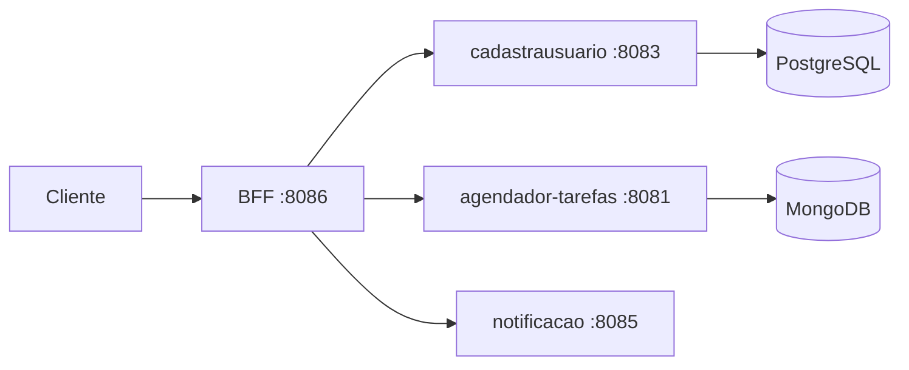

# Sistema de Agendamento — BFF

Backend for Frontend em **Java 21** e **Spring Boot** que centraliza o acesso a três serviços: usuários, tarefas e notificações.

Este é um case de estudo de arquitetura distribuída. O projeto demonstra integração REST com OpenFeign, autenticação JWT propagada entre serviços e execução coordenada com Docker Compose.

## Arquitetura



## Responsabilidades

- centralizar os endpoints consumidos pelo cliente;
- encaminhar autenticação e chamadas aos serviços internos;
- consultar usuários e endereços;
- criar, listar, atualizar e remover tarefas;
- solicitar o envio de notificações.

## Repositórios relacionados

- [cadastrausuario](https://github.com/JhonathanDominick/cadastrausuario) — usuários, autenticação e PostgreSQL;
- [agendador-tarefas](https://github.com/JhonathanDominick/agendador-tarefas) — tarefas e MongoDB;
- [notificacao](https://github.com/JhonathanDominick/notificacao) — envio de e-mails.

Os quatro repositórios devem ficar em diretórios irmãos para que os contextos de build do Compose funcionem:

```text
workspace/
├── bff-agendador-tarefas/
├── cadastrausuario/
├── agendador-tarefas/
└── notificacao/
```

## Executar com Docker

Na pasta do BFF:

```bash
docker compose up --build
```

O BFF fica disponível em `http://localhost:8086`. Quando habilitada pela aplicação, a documentação OpenAPI pode ser acessada em `http://localhost:8086/swagger-ui/index.html`.

> O Compose atual é voltado a desenvolvimento local. Revise credenciais e configurações antes de usar fora desse contexto.

## Executar apenas o BFF

Requisitos: Java 21 e os três serviços internos em execução nas URLs configuradas em `application.properties`.

```bash
./mvnw spring-boot:run
```

No Windows:

```powershell
.\mvnw.cmd spring-boot:run
```

## Verificação

```bash
./mvnw --batch-mode verify
```

Pull requests para `main` executam essa verificação no GitHub Actions.

## Limitações e próximos passos

- ampliar os testes automatizados além do teste de contexto;
- remover credenciais locais do Compose em favor de `.env`;
- adicionar timeouts, circuit breaker e observabilidade;
- documentar contratos e erros entre os serviços.

## Autor

Desenvolvido por **Jhonathan Dominick**.

[LinkedIn](https://linkedin.com/in/jhonathan-dominick-013a36326) · [GitHub](https://github.com/JhonathanDominick)
